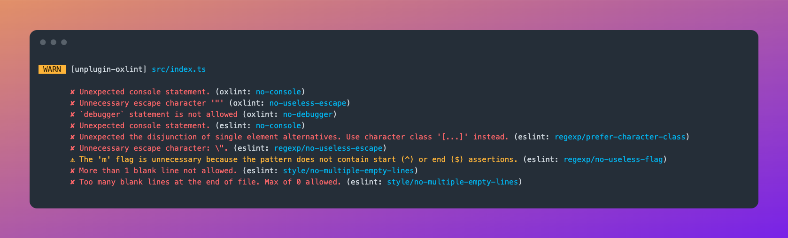

# unplugin-oxlint

[](https://www.npmjs.com/package/unplugin-oxlint)

🌋 A universal bundler plugin for integrating the [Oxlint](https://oxc-project.github.io/docs/guide/usage/linter.html) linter into your project, based on [vite-plugin-oxlint](https://github.com/52-entertainment/vite-plugin-oxlint).

## Features

🚀 A quick and simple way to use oxlint in your project.

🛠️ Support linting with both bundler plugin and Node.js API.

⚙️ Support common bundlers like Vite, Rollup, esbuild, and Webpack by [unplugin](https://github.com/unjs/unplugin).

🔍 Support mixed use in eslint projects by [eslint-plugin-oxlint](https://github.com/oxc-project/eslint-plugin-oxlint).

😊 Friendly output in terminal, grouped by filepath, and support including targets with glob patterns.

⚡ Only lint the files that have changed for better performance by [chokidar](https://github.com/paulmillr/chokidar).



## Installation

```bash
# npm
npm i -D oxlint unplugin-oxlint

# pnpm
pnpm add -D oxlint unplugin-oxlint

# yar
yarn add -D oxlint unplugin-oxlint
```

## Usage

### `Bundler Plugin`

Recommended the bundler plugin way to use the full `options` of `unplugin-oxlint`.

<details>
<summary>Vite</summary><br>

```ts
// vite.config.ts
import Oxlint from 'unplugin-oxlint/vite'

export default defineConfig({
  plugins: [Oxlint()],
})
```

<br></details>

<details>
<summary>Rollup</summary><br>

```ts
// rollup.config.js
import Oxlint from 'unplugin-oxlint/rollup'

export default {
  plugins: [Oxlint()],
}
```

<br></details>

<details>
<summary>esbuild</summary><br>

```ts
// esbuild.config.js
import { build } from 'esbuild'

build({
  plugins: [require('unplugin-oxlint/esbuild')()],
})
```

<br></details>

<details>
<summary>Webpack</summary><br>

```ts
// webpack.config.js
module.exports = {
  /* ... */
  plugins: [require('unplugin-oxlint/webpack')()],
}
```

<br></details>

### `Command`

You can also use `unox` command to lint files like eslint

```json
// package.json
{
  "scripts": {
    "lint": "unox",
    "lint:fix": "unox --fix"
  }
}
```

`unox` support most of the options of `unplugin-oxlint`, use them as params like:

```bash
unox src/**/*.ts --watch
```

For further configuration, create a config file named `unox.config.{js,cjs,mjs,ts,mts,cts}`

## Playground

See [playground]('./playground').

## ESLint

If you are looking for a way to use oxlint in projects that still need ESLint, You can use [eslint-plugin-oxlint](https://github.com/oxc-project/eslint-plugin-oxlint) to turn off ESLint rules that are already supported by oxlint.

The rules are extracted from [here](https://github.com/oxc-project/eslint-plugin-oxlint?tab=readme-ov-file)

`unplugin-oxlint` will automatically run the `eslint` script after `oxlint` when build start and file change.

```bash
# npm
npm i -D eslint eslint-plugin-oxlint

# pnpm
pnpm add -D eslint eslint-plugin-oxlint

# yarn
yarn add -D eslint eslint-plugin-oxlint
```

### Example

Use [eslint-plugin-oxlint](https://github.com/oxc-project/eslint-plugin-oxlint) with [@antfu/eslint-config](https://github.com/antfu/eslint-config)

```js
// eslint.config.js
import antfu from '@antfu/eslint-config'
import oxlint from 'eslint-plugin-oxlint'

export default antfu({
  ...oxlint.configs['flat/recommended'],
})
```

## Options

For all options please refer to [docs](https://github.com/52-entertainment/vite-plugin-oxlint).

This plugin accepts most options of [vite-plugin-oxlint](https://github.com/52-entertainment/vite-plugin-oxlint), and some extra options that are specific to this plugin.

### ~~`options.path`~~

- ~~Type: `string | string[]`~~
- ~~Default: `'.'`~~

### `options.includes`

- Type: `string | string[]`
- Default: `'**/*.{js,ts,jsx,tsx,vue}'`

Paths to files, dirs to be watched by glob patterns

### `options.excludes`

- Type: `RegExp[]`
- Default: `[/[\\/]node_modules[\\/]/, /[\\/]\.git[\\/]/]`

### `options.rootDir`

- Type: `string`
- Default: `'.'`

### `options.fix`

- Type: `boolean`
- Default: `false`

Fix as many issues as possible. Only unfixed issues are reported in the output

### `options.watch`

- Type: `boolean`
- Default: `false`

Continue to watch for changes in any of the resolved path

### `options.config`

- Type: `string`
- Default: `''`

ESLint configuration file

### `options.noIgnore`

- Type: `boolean`
- Default: `false`

Disables excluding of files from .eslintignore files, `--ignore-path` flags and `--ignore-pattern` flags

### `options.quiet`

- Type: `boolean`
- Default: `false`

Disable reporting on warnings, only errors are reported

### `options.denyWarnings`

- Type: `boolean`
- Default: `false`

Ensure warnings produce a non-zero exit code

### `options.packageManager`

- Type: `'npm' | 'pnpm' | 'yarn' | 'bun'`

Declare the package manager which you want to use

Normally you don't need to modify this option. `unplugin-oxlint` will automatically detect `package.json` and lock file by [nypm](https://github.com/unjs/nypm)

## License

[MIT](./LICENSE) License © 2024-PRESENT [Tamago](https://github.com/tmg0)
